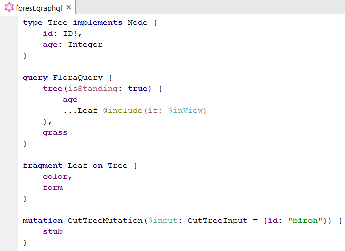
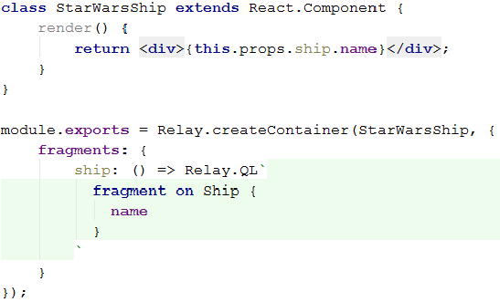

# GraphQL Intellij Plugin

- syntax highlighting
- brace matching

At the moment no separate color settings are available. The styles above can be achieved by manipulating the default language highlighting.

It's also possible to inject GraphQL into strings (Alt+Enter inside of the string):

## TODO:
- comments
- auto-inject GraphQL for string preceeded by `Relay.QL`
- resolve references